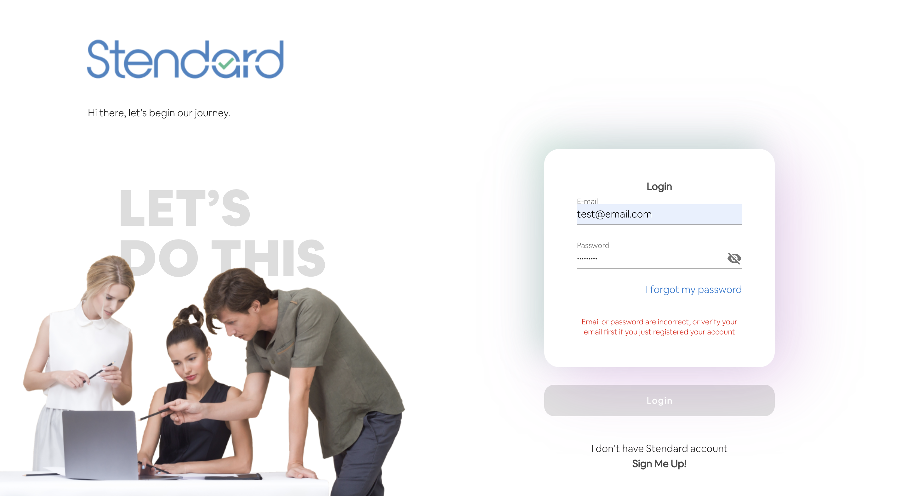
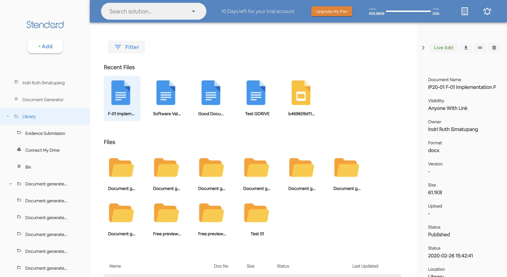
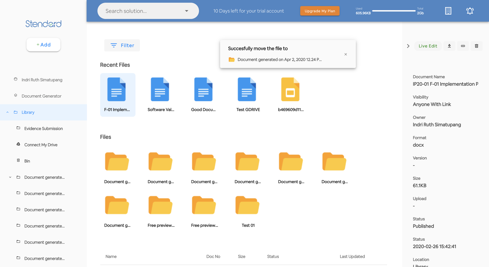
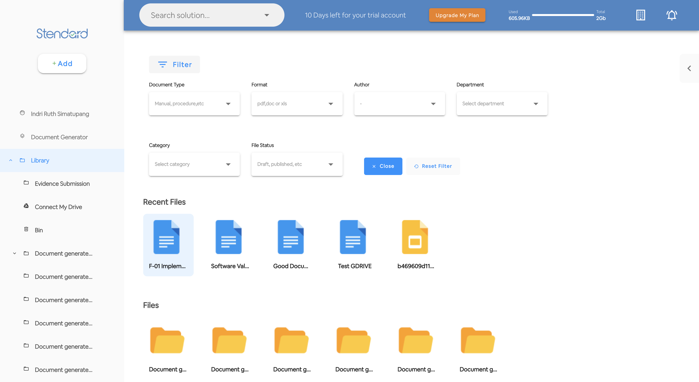

# Simple Admin Dashboard

Admin dashboard using Laravel + Vue and Vuetify

## Project setup
```
npm install
```

### Compiles and hot-reloads for development
```
npm run watch
```

```
php artisan serve
```

## Screen Capture

**Login page** 


**Login page - wrong password**



**Dashboard Default**



**Move File Alert**



**Open filter options**


